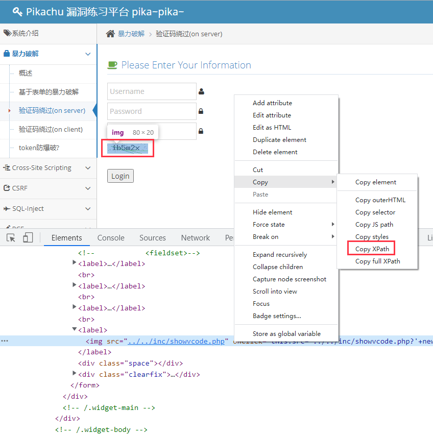
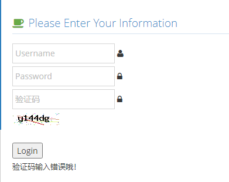
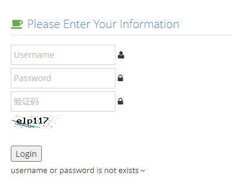

# weakpass_exploit

网站弱口令爆破小脚本

优点：

- 绕过图形验证码
- 绕过前端数据加密

不足：

- ddddocr识别不够精确
- 单线程

注: 本项目所有文件仅供学习和研究使用,请勿使用项目中的技术源码用于非法用途,任何人造成的任何负面影响,与本人无关.

## 更新
2023-12-21 更新了说明文档，对配置文件的字段进行了说明

2023-2-27 更新了说明文档，修改了部分代码

2023-2-3   优化了登录判断逻辑，现在会根据登陆成功或失败后跳转的页面进行检索，匹配关键字判断是否登录成功

## 安装

python 3.7+

ddddocr

selenium

[chromedriver.exe](https://chromedriver.chromium.org/downloads)

```
通过这个链接查看支持的版本：
https://chromedriver.storage.googleapis.com/LATEST_RELEASE
通过这个链接下载需要的版本：
https://chromedriver.chromium.org/downloads
```

## 配置

在conf.json中，参照以下内容进行配置，以pikachu靶场为例

复制页面元素的XPath填入到conf.json中



验证码错误时会提示



用户名密码错误时会提示



配置文件字段含义

```
url：登陆页面的URL
driver_path：本地chromedriver程序的路径
user_xpath：用户名输入框的xpath路径
pass_xpath：密码输入框的xpath路径
orc_input_xpath：验证码输入框的xpath路径
orc_xpath：验证码的xpath路径
login_button_xpath：登陆按钮的xpath路径
orc_res_xpath：登陆结果回显位置的xpath路径（本例中登陆结果回显在登陆按钮的下方，按照上面提供的方法直接复制文字的xpath路径配置即可）
regex_verify_res：验证码识别失败的提示语
regex_login_fail_res：验证码识别成功但是账户或者口令错误的提示语
```

配置完成如下：

```json
{
	"url": "http://192.168.86.186/pikachu-master/vul/burteforce/bf_server.php",
	"driver_path": "D:/python3/chromedriver.exe",
	"user_xpath": "//*[@id=\"main-container\"]/div[2]/div/div[2]/div/div/form/label[1]/span/input",
	"pass_xpath": "//*[@id=\"main-container\"]/div[2]/div/div[2]/div/div/form/label[2]/span/input",
	"orc_input_xpath": "//*[@id=\"main-container\"]/div[2]/div/div[2]/div/div/form/label[3]/span/input",
	"orc_xpath": "//*[@id=\"main-container\"]/div[2]/div/div[2]/div/div/form/label[4]/img",
	"login_button_xpath": "//*[@id=\"main-container\"]/div[2]/div/div[2]/div/div/form/div[2]/label/input",
	"orc_res_xpath": "//*[@id=\"main-container\"]/div[2]/div/div[2]/div/div/p",
	"regex_verify_res": "验证码输入错误哦",
	"regex_login_fail_res": "username or password is not exists"
}
```

## 使用

开始使用

```
Usage: usage weakpass_exploit.py -u <username dict> -p <password dict> -c <config file>

Options:
  -h, --help        show this help message and exit
  -u USERNAME_DICT  Enter the username dict eg:user.txt
  -p PASSWORD_DICT  Enter the password dict eg:pass.txt
  -c CONFIG_FILE    Enter the config file eg:conf.json
  -e                Use headless model eg: -e
```


